# DevOps Project Report: Automated CI/CD Pipeline for a 2-Tier Flask Application on AWS


---

### **Table of Contents**
1. [Project Overview](#1-project-overview)
2. [Architecture Diagram](#2-architecture-diagram)
3. [Step 1: AWS EC2 Instance Preparation](#3-step-1-aws-ec2-instance-preparation)
4. [Step 2: Install Dependencies on EC2](#4-step-2-install-dependencies-on-ec2)
5. [Step 3: Jenkins Installation and Setup](#5-step-3-jenkins-installation-and-setup)
6. [Step 4: GitHub Repository Configuration](#6-step-4-github-repository-configuration)
    * [Dockerfile](#dockerfile)
    * [docker-compose.yml](#docker-composeyml)
    * [Jenkinsfile](#jenkinsfile)
7. [Step 5: Jenkins Pipeline Creation and Execution](#7-step-5-jenkins-pipeline-creation-and-execution)

---

### **1. Project Overview**
This document outlines the step-by-step process for deploying a 2-tier web application (Flask + MySQL) on an AWS EC2 instance. The deployment is containerized using Docker and Docker Compose. A full CI/CD pipeline is established using Jenkins to automate the build and deployment process whenever new code is pushed to a GitHub repository.

---

### **2. Architecture Diagram**

```
+-----------------+      +----------------------+      +-----------------------------+
|   Developer     |----->|     GitHub Repo      |----->|        Jenkins Server       |
| (pushes code)   |      | (Source Code Mgmt)   |      |  (on AWS EC2)               |
+-----------------+      +----------------------+      |                             |
                                                       | 1. Clones Repo              |
                                                       | 2. Builds Docker Image      |
                                                       | 3. Runs Docker Compose      |
                                                       +--------------+--------------+
                                                                      |
                                                                      | Deploys
                                                                      v
                                                       +-----------------------------+
                                                       |      Application Server     |
                                                       |      (Same AWS EC2)         |
                                                       |                             |
                                                       | +-------------------------+ |
                                                       | | Docker Container: Flask | |
                                                       | +-------------------------+ |
                                                       |              |              |
                                                       |              v              |
                                                       | +-------------------------+ |
                                                       | | Docker Container: MySQL | |
                                                       | +-------------------------+ |
                                                       +-----------------------------+
```

---

### **3. Step 1: AWS EC2 Instance Preparation**

1.  **Launch EC2 Instance:**
    * Navigate to the AWS EC2 console.
    * Launch a new instance using the **Linux 2023 ** AMI.
    * Select the **t2.micro** instance type for free-tier eligibility.
    * Create and assign a new key pair for SSH access.

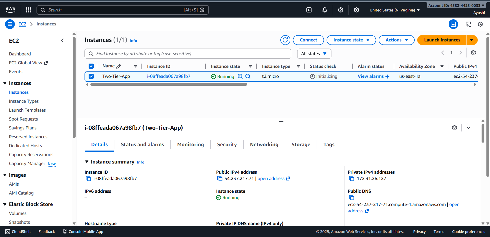

2.  **Configure Security Group:**
    * Create a security group with the following inbound rules:
        * **Type:** SSH, **Protocol:** TCP, **Port:** 22, **Source:** Your IP
        * **Type:** HTTP, **Protocol:** TCP, **Port:** 80, **Source:** Anywhere (0.0.0.0/0)
        * **Type:** Custom TCP, **Protocol:** TCP, **Port:** 5000 (for Flask), **Source:** Anywhere (0.0.0.0/0)
        * **Type:** Custom TCP, **Protocol:** TCP, **Port:** 8080 (for Jenkins), **Source:** Anywhere (0.0.0.0/0)

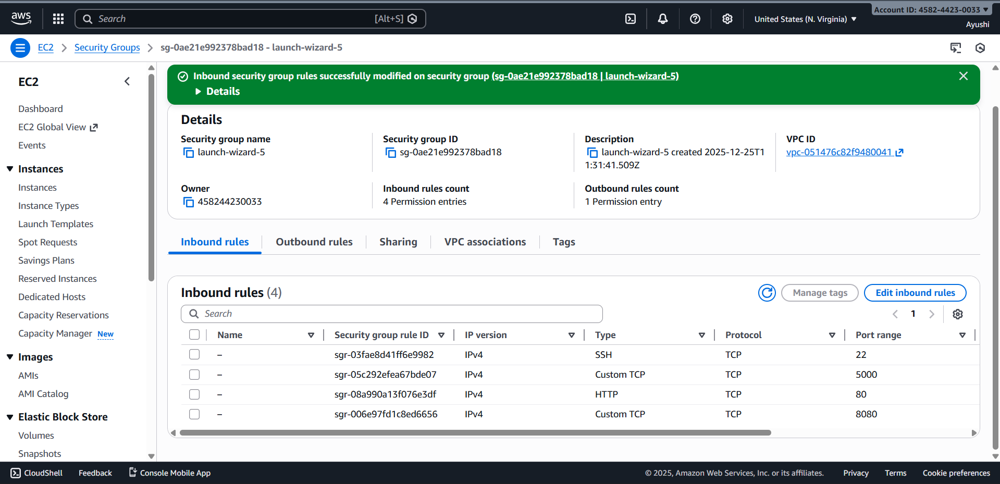

3.  **Connect to EC2 Instance:**
    * Use SSH to connect to the instance's public IP address.
    ```bash
    ssh -i /path/to/key.pem ubuntu@<ec2-public-ip>
    ```
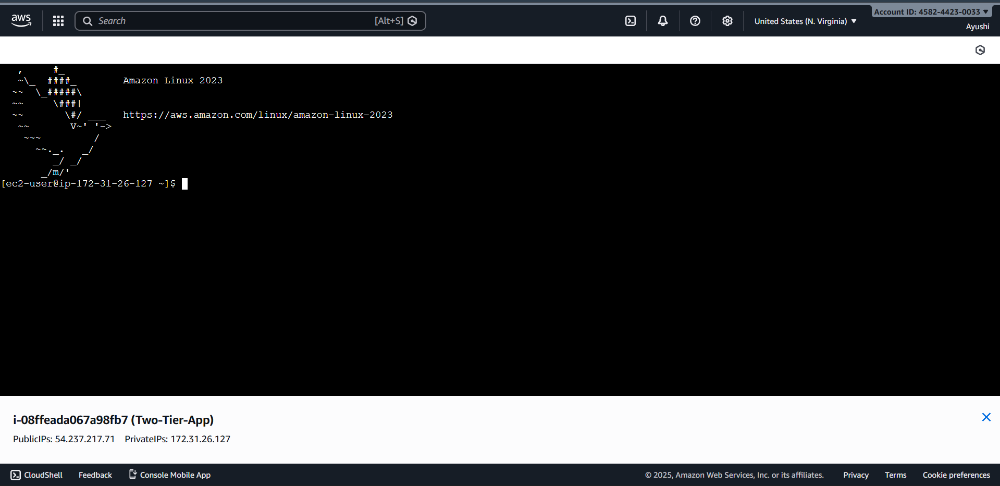

---

### **4. Step 2: Install Dependencies on EC2**

1.  **Update System Packages:**
    ```bash
    sudo apt update && sudo apt upgrade -y
    ```
2.  **Install Git, Docker, and Docker Compose:**
    ```bash
    sudo apt install git docker.io docker-compose-v2 -y
    ```
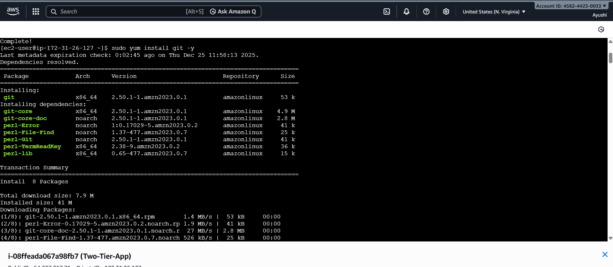
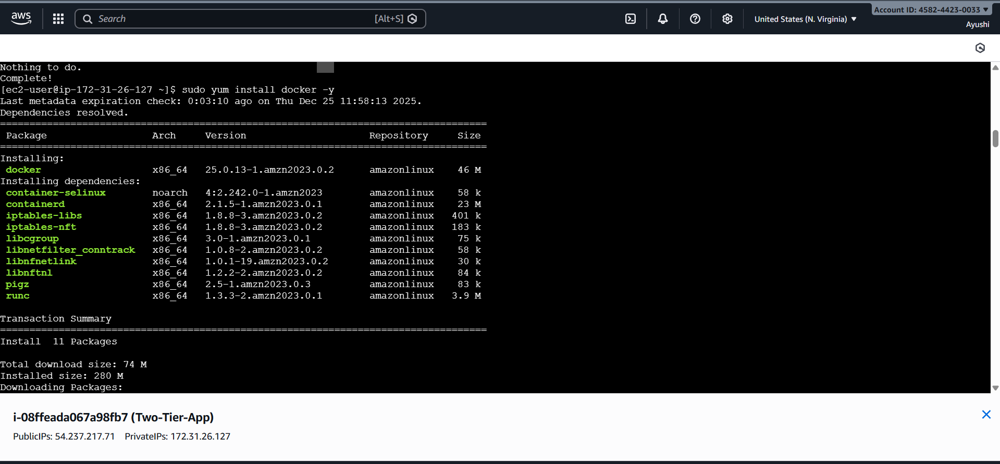

3.  **Start and Enable Docker:**
    ```bash
    sudo systemctl start docker
    sudo systemctl enable docker
    ```
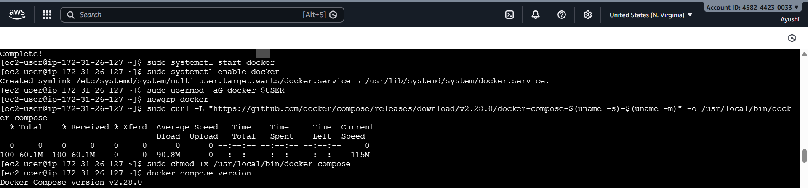

4.  **Add User to Docker Group (to run docker without sudo):**
    ```bash
    sudo usermod -aG docker $USER
    newgrp docker
    ```

---

### **5. Step 3: Jenkins Installation and Setup**

1.  **Create a script file install_jenkins.sh:**
    #### **install_jenkins.sh**

```
bash
#!/bin/bash
# Install Java
sudo apt install openjdk-17-jdk -y 

curl -fsSL https://pkg.jenkins.io/debian-stable/jenkins.io-2023.key | sudo tee /usr/share/keyrings/jenkins-keyring.asc > /dev/null 
echo deb [signed-by=/usr/share/keyrings/jenkins-keyring.asc] https://pkg.jenkins.io/debian-stable binary/ | sudo tee /etc/apt/sources.list.d/jenkins.list > /dev/null 

sudo apt update 
sudo apt install jenkins -y sudo 

systemctl start jenkins
sudo systemctl enable

jenkins sudo usermod -aG docker 
jenkins sudo systemctl restart jenkins
```
2.  **Make the script executable and run it:**
    ```bash
    chmod +x install_jenkins.sh
    ./install_jenkins.sh

    ```
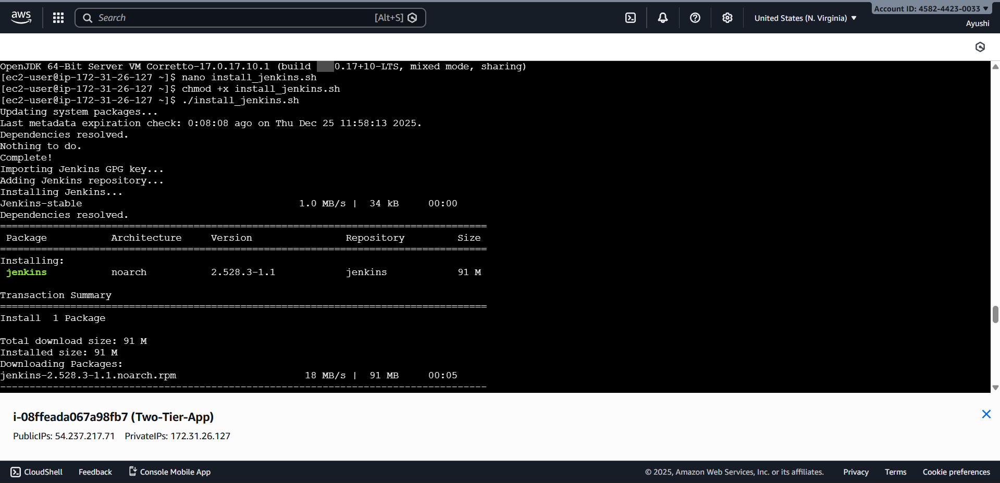


3.  **Initial Jenkins Setup:**
    * Retrieve the initial admin password:
        ```bash
        sudo cat /var/lib/jenkins/secrets/initialAdminPassword
        ```
      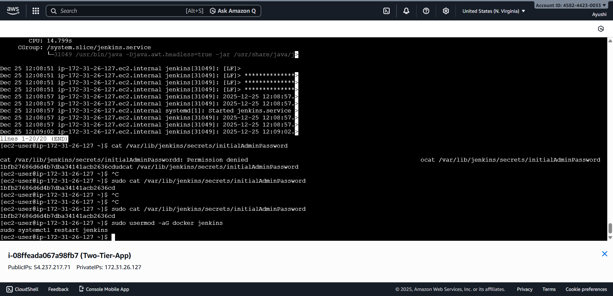
    * Access the Jenkins dashboard at `http://<ec2-public-ip>:8080`.
    * Paste the password, install suggested plugins, and create an admin user.
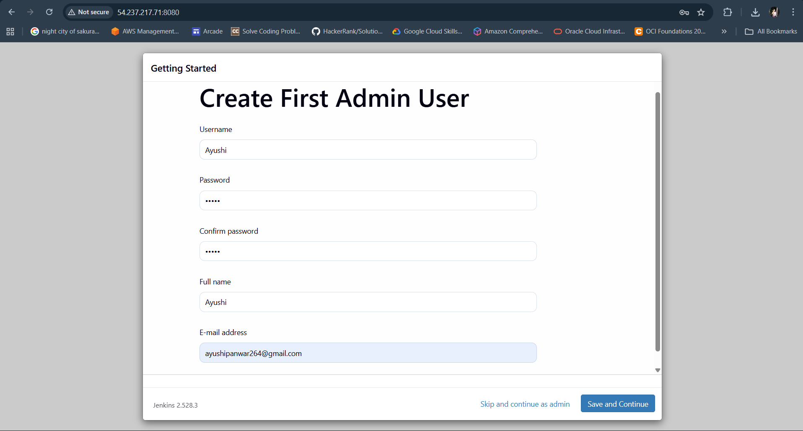

5.  **Grant Jenkins Docker Permissions:**
    ```bash
    sudo usermod -aG docker jenkins
    sudo systemctl restart jenkins
    ```
---

### **6. Step 4: GitHub Repository Configuration**

Ensure your GitHub repository contains the following three files.

#### **Dockerfile**
#### **docker-compose.yml**
#### **Jenkinsfile**
---

### **7. Step 5: Jenkins Pipeline Creation and Execution**

1.  **Create a New Pipeline Job in Jenkins:**
    * From the Jenkins dashboard, select **New Item**.
    * Name the project, choose **Pipeline**, and click **OK**.
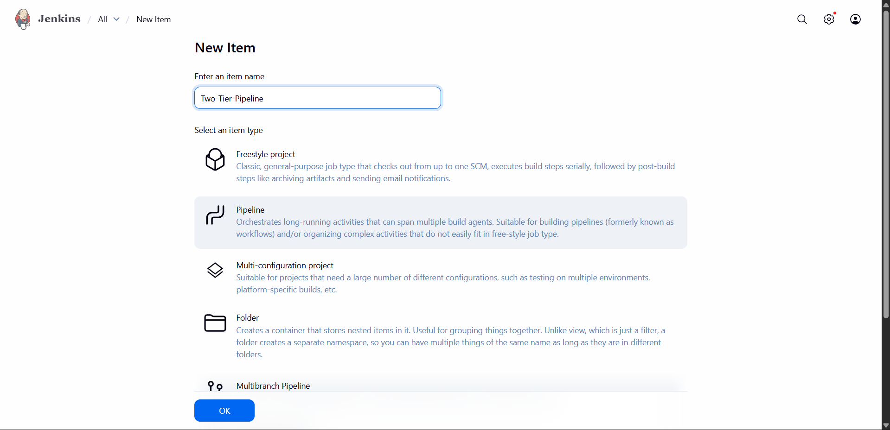

2.  **Configure the Pipeline:**
    * In the project configuration, scroll to the **Pipeline** section.
    * Set **Definition** to **Pipeline script from SCM**.
    * Choose **Git** as the SCM.
    * Enter your GitHub repository URL.
    * Verify the **Script Path** is `Jenkinsfile`.
    * Save the configuration.

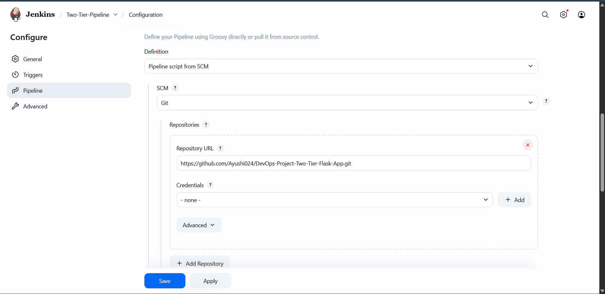

3.  **Run the Pipeline:**
    * Click **Build Now** to trigger the pipeline manually for the first time.
    * Monitor the execution through the **Stage View** or **Console Output**.

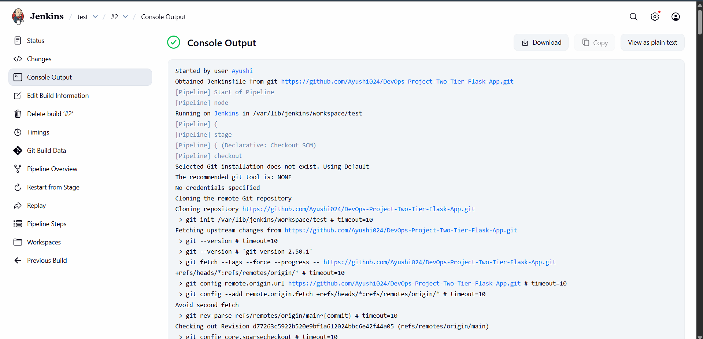


4.  **Verify Deployment:**
    * After a successful build, your Flask application will be accessible at `http://<your-ec2-public-ip>:5000`.
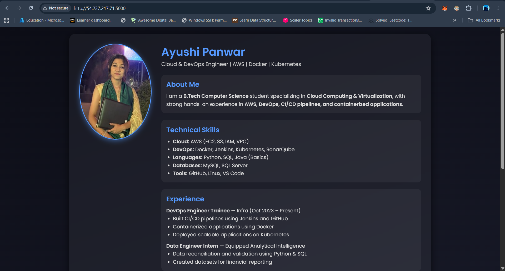

    * Confirm the containers are running on the EC2 instance with `docker ps`.

---
